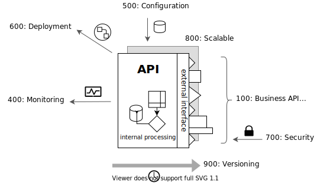

# API Guidelines

At Zelros,

100: An API is business-oriented, 
200: An API is standard, 
300: An API is documented, 
400: An API is monitored, 
500: An API is configurable, 
600: An API is ready to deploy, 
700: An API is secured by authentication, 
800: An API is scalable, 
900: An API is versioned.

## 100: Think as Business API

## 200: Stick to the standard

## 300: Document every usages

## 400: Always monitor

## 500: Configure behaviour

## 600: Be ready to deploy

## 700: Secure with authentication

## 800: Scale

## 900: Manage multiple versions

